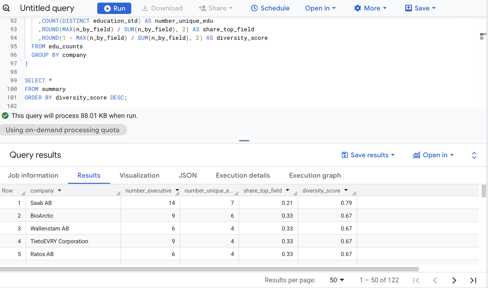

# Interview-Case-Study-DataAnalyst

## 🏢 Company

 

**Nordic Business Diversity Index (NBDI)** - is a team of professionals from leading sustainability consulting company Impaktly, the most extensive business diversity ranking in the Nordics. 

This is a Case assignment for **Data Analyst Trainee 2026** position.

---

## 🎯 Objective
Analyze the **educational diversity** of executive management teams using data from  
`Stockholm_Large_NBDI2025.xlsx`, converted to CSV and analyzed in **Google BigQuery**.

---

## 📊 Task Overview
The goal was to evaluate how diverse executive management teams are in terms of **educational background**.  

Main objectives:
1. Clean and standardize company and executive data.  
2. Focus only on **Executive Management** (exclude Board of Directors).  
3. Normalize education fields into the following categories:
   - Business  
   - Law  
   - Engineering  
   - Sciences  
   - Humanities  
   - Medicine  
   - Arts  
   - Other / N/A  
4. Calculate for each company:
   - Number of executives  
   - Number of unique education categories  
   - Share of the most common education field  
   - **Diversity Score** = `1 - Σ(pᵢ²)`, where `pᵢ` is the share of executives per education category.

---

## 🧹 Data Preparation (in BigQuery)
1. Converted the Excel file **`Stockholm_Large_NBDI2025.xlsx`** (sheet `"Data"`) into **`Stockholm_Large_NBDI2025.csv`** using Excel or Python (`pandas.to_csv()`).
2. Uploaded the CSV file to **Google BigQuery** using the **BigQuery Web UI**.  
3. Created a dataset and table named `cosmic-axe-464811-t3.Casestudyinterview.NBDI2025`. 
4. Verified column types (string, integer, etc.) and ensured UTF-8 encoding.

---

## 🧮 Analysis Logic (BigQuery SQL)

Step 1: Clean and categorize education fields (using LOWER() syntax)

Step 2: Count and calculate proportions per company 

Step 3: Compute diversity score per company

---

## 🧰 Tools Used
Platform: Google BigQuery

Language: Standard SQL

Data Source: CSV (converted from Excel: Stockholm_Large_NBDI2025.xlsx / sheet “Data”) 

Output: NBDI2025_casestudy_interview.csv.

---

## 📜 Query

``` sql
-- using LOWER() to clean and standardise data. 

WITH cleaned AS (
  SELECT
    company
    ,CASE
      WHEN LOWER(department) LIKE '%execut%' THEN 'Executive'
      WHEN LOWER(department) LIKE '%board%' THEN 'Board'
      ELSE NULL
    END AS role
    ,position
    ,educational_background
    ,gender
    ,nationality
    ,year_of_Birth
  FROM `cosmic-axe-464811-t3.Casestudyinterview.NBDI2025`
)

-- Only keep Executive
,executive_only AS (
  SELECT *
  FROM cleaned
  WHERE role = 'Executive'
)

-- gender standardisation 
,gender_clean AS (
  SELECT
    *
    ,CASE
      WHEN LOWER(gender) IN ('m', 'male') THEN 'Male'
      WHEN LOWER(gender) IN ('f', 'female') THEN 'Female'
      ELSE 'Other/Unknown'
    END AS gender_std
  FROM executive_only
)

-- educational background standardisation
,edu_clean AS (
  SELECT
    company
    ,gender_std
    ,position
    ,nationality
    ,year_of_birth
    ,CASE
      WHEN educational_background IS NULL OR TRIM(educational_background) = '' THEN 'N/A'
      WHEN LOWER(educational_background) LIKE '%business%' 
        OR LOWER(educational_background) LIKE '%economics%' 
        OR LOWER(educational_background) LIKE '%finance%' 
        THEN 'Business'
      WHEN LOWER(educational_background) LIKE '%law%' 
        OR LOWER(educational_background) LIKE '%legal%' 
        THEN 'Law'
      WHEN LOWER(educational_background) LIKE '%engineer%' 
        THEN 'Engineering'
      WHEN LOWER(educational_background) LIKE '%science%' 
        OR LOWER(educational_background) LIKE '%biology%' 
        OR LOWER(educational_background) LIKE '%chemistry%' 
        OR LOWER(educational_background) LIKE '%physics%' 
        THEN 'Sciences'
      WHEN LOWER(educational_background) LIKE '%history%' 
        OR LOWER(educational_background) LIKE '%philosophy%' 
        OR LOWER(educational_background) LIKE '%literature%' 
        THEN 'Humanities'
      WHEN LOWER(educational_background) LIKE '%medicine%' 
        OR LOWER(educational_background) LIKE '%medical%' 
        THEN 'Medicine'
      WHEN LOWER(educational_background) LIKE '%art%' 
        OR LOWER(educational_background) LIKE '%design%' 
        THEN 'Arts'
      ELSE CONCAT('Other: ', educational_background)
    END AS education_std
  FROM gender_clean
)

-- Count the number of people by field of education in each company
,edu_counts AS (
  SELECT
    company
    ,education_std
    ,COUNT(*) AS n_by_field
  FROM edu_clean
  GROUP BY company, education_std
)

-- calculation 
,summary AS (
  SELECT
    company
    ,SUM(n_by_field) AS number_executive
    ,COUNT(DISTINCT education_std) AS number_unique_edu
    ,ROUND(MAX(n_by_field) / SUM(n_by_field), 2) AS share_top_field
    ,ROUND(1 - MAX(n_by_field) / SUM(n_by_field), 2) AS diversity_score
  FROM edu_counts
  GROUP BY company
)

SELECT *
FROM summary
ORDER BY diversity_score DESC;
```

---

## 📈 Results and Key Insights 



### Key Insights 
   🧭 1. Overall Trends

| Metric | Key Observation |
|--------|----------------|
| **Average diversity score** | Around **0.43–0.45**, indicating that most executive teams are dominated by one educational field. |
| **Typical share of top field** | Ranges between **0.5 and 0.7**, meaning one degree field represents half to two-thirds of the leadership team. |
| **Unique education fields per company** | Typically **3–4**, showing moderate interdisciplinarity. |
| **Team size vs. diversity** | Larger executive teams do **not necessarily** have higher educational diversity — e.g., *Ericsson (17 execs, low diversity 0.29)* vs. *Saab AB (14 execs, high diversity 0.79)*. |

🧩 **Conclusion:**  
The Nordic corporate landscape remains heavily shaped by **business and engineering backgrounds**, with limited academic heterogeneity overall.  
However, several companies show exceptional interdisciplinary leadership.

---

   🥇 2. Companies with the Highest Educational Diversity

| Category | Criteria | Example Companies | Key Takeaway |
|----------|-----------|------------------|--------------|
| **High diversity (≥ 0.7)** | Multiple degree fields, no single field > ⅓ of team | **Saab AB (0.79)**, **BioArctic (0.67)**, **Wallenstam**, **TietoEVRY**, **Ratos** | Saab AB leads with 14 executives across 7 unique fields — its leadership reflects a **strong mix of technical, business, science, and legal backgrounds.** |
| **Medium diversity (0.4–0.6)** | One or two dominant academic fields | **Sandvik, Volvo Group, SKF, SCA, AFRY, Arjo** | Engineering-heavy firms show moderate diversity thanks to additions from economics or law. |
| **Low diversity (≤ 0.3)** | Almost all executives from one field | **Intrum (0.26)**, **Swedbank (0.2)**, **Kinnevik (0.14)**, **AAK (0.13)** | Financial and FMCG companies tend to have **very homogeneous educational profiles**, typically within business or finance. |

---

   ⚠️ 3. Companies with Zero Educational Diversity (Score = 0)

| Company Examples | Description |
|------------------|--------------|
| **Securitas, Handelsbanken, Sweco, Tele2, Addnode, Biotage, Fenix Outdoor, H&M, etc.** | All executives share the same educational background. |
| **Implications:** |
| - Indicates **over-specialization** within leadership. |
| - May limit **strategic adaptability** and **cross-disciplinary innovation** — key factors for ESG and digital transformation. |

---

   🧠 4. Cross-Sector Insights

- **Industrial / Engineering firms** → Moderate diversity (0.4–0.6).  
  → Blend of engineering, economics, and management backgrounds.  
- **Finance & Banking** → Low diversity (0.2–0.3).  
  → Heavily dominated by business/economics degrees.  
- **Bio/MedTech** → Higher diversity than average.  
  → Mix of medicine, science, and business education (e.g., *BioArctic*, *Sobi*, *Camurus*).

---

   📊 5. Summary by Diversity Level

| Level | Diversity Score | Approx. # of Companies | General Characteristics |
|--------|------------------|------------------------|--------------------------|
| **High** | ≥ 0.7 | ~10 | Strong interdisciplinary mix |
| **Medium** | 0.4–0.7 | ~50 | Balanced but still field-heavy |
| **Low** | < 0.4 | ~40 | Single-discipline leadership |

---

## 🗂 Repository Structure
```
├── solution_bigquery.sql
├── Stockholm_Large_NBDI2025.xlsx
├── Stockholm_Large_NBDI2025.csv
├── NBDI2025_casestudy_interview.csv
└── README.md
```
